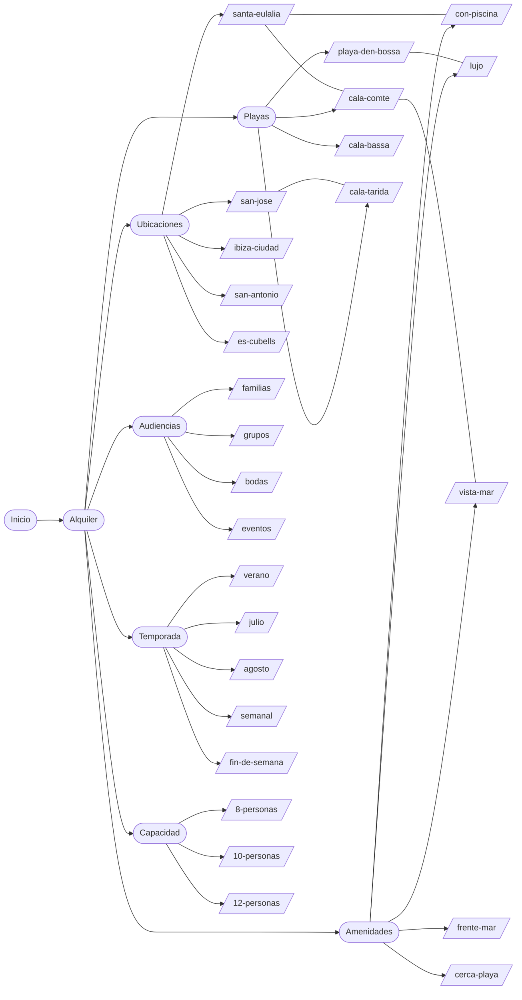
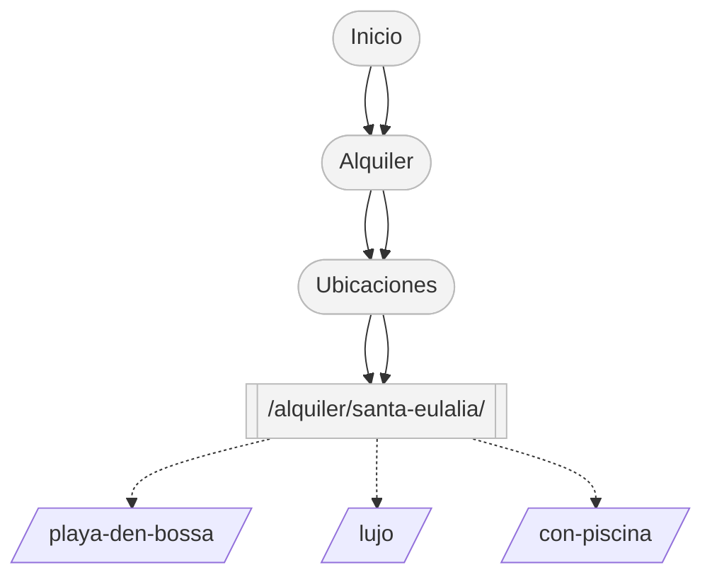
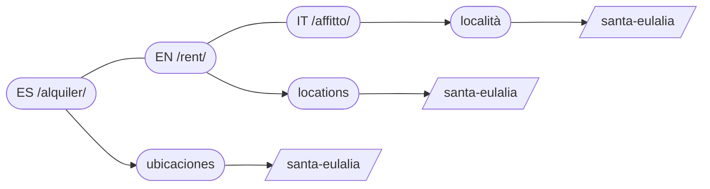
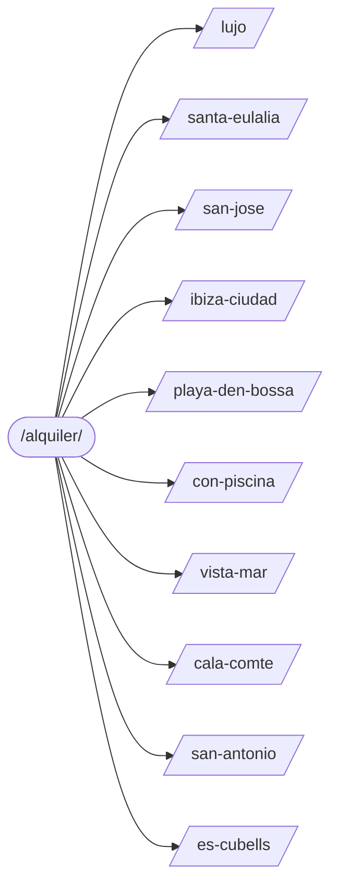

# Arquitectura gráfica — ibizavilla.com/alquiler/

Este archivo presenta la arquitectura con el prefijo `/alquiler/` de forma gráfica (diagramas Mermaid y árbol ASCII) para facilitar su comprensión, implementación y validación.

> Nota: Los diagramas Mermaid se renderizan en visores compatibles (GitHub, extensiones de VS Code/Trae, etc.).

---

## Diagrama general (categorías y ejemplos)



---

## Árbol de URLs (ASCII)

```
ibizavilla.com/alquiler/
├── ubicaciones/
│   ├── santa-eulalia/
│   ├── san-jose/
│   ├── ibiza-ciudad/
│   ├── san-antonio/
│   └── es-cubells/
├── playas/
│   ├── playa-den-bossa/
│   ├── cala-comte/
│   ├── cala-bassa/
│   └── cala-tarida/
├── amenidades/
│   ├── lujo/
│   ├── con-piscina/
│   ├── vista-mar/
│   └── frente-mar/
├── audiencias/
│   ├── familias/
│   ├── grupos/
│   ├── bodas/
│   └── eventos/
├── temporada/
│   ├── verano/
│   ├── julio/
│   ├── agosto/
│   ├── semanal/
│   └── fin-de-semana/
└── capacidad/
    ├── 8-personas/
    ├── 10-personas/
    └── 12-personas/
```

---

## Breadcrumbs e interlinking



---

## Internacionalización (espejo)



---

## Top 10 prioritarios (visual)



---

## Notas rápidas de implementación
- Slugs en español, normalizados: minúsculas, guiones, sin acentos.
- Titles/H1 orientados a “Alquiler de villas … en Ibiza”.
- Interlinking entre Ubicaciones ↔ Playas ↔ Amenidades para distribuir autoridad.
- 301 desde URLs antiguas `/villas/...` y `/villa/...` a `/alquiler/...` equivalentes.

```
Ejemplo de breadcrumb: Inicio > Alquiler > Ubicaciones > Santa Eulalia
Ejemplo de H1: Alquiler de villas en Santa Eulalia (Ibiza)
```

---

## Referencias
- Propuesta detallada: `FASE_3_ARQUITECTURA/09_propuesta_arquitectura.md`
- Slugs priorizados: `FASE_3_ARQUITECTURA/10_slugs_priorizados_alquiler.md`
```
```